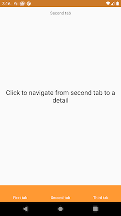
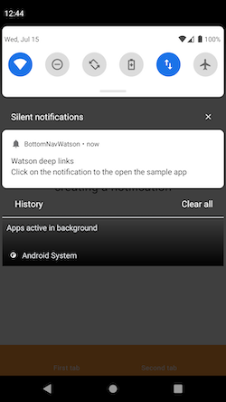

An Android library that allows, when using the BottomNavigationBar, to consume the multiple back stack workaround provided on [Google Samples](https://github.com/android/architecture-components-samples/blob/master/NavigationAdvancedSample/app/src/main/java/com/example/android/navigationadvancedsample/NavigationExtensions.kt) with one single navigation graph per application.

### When to use this library?
When using the BottomNavigationBar, the Navigation component, multiple back stack workaround and one single nav graph per app.

### Why would I want to use one single navigation graph per app?
You may don't want to, but based on our experience, when using Navigation component in conjunction with [Safe Args](https://developer.android.com/topic/libraries/architecture/navigation/navigation-pass-data#Safe-args) plugin, using nested graphs will make you repeat yourself like a parrot.

<details>
  <summary>See these limitations</summary>
  
  1. The arguments declared in the destination of another graph need to be copy/paste into the action that points to that destination. This leads to huge duplications of code and also opens the door to dangerous situations: if you add a new argument to the destination and forget to update all the actions that point to that destination (and there can be a lot of screens), the app will crash at runtime and the SafeArgs plugin will not be longer "safe".
  2. Global actions can not be shared between graphs, which means that any screen accessing another screen that is not declared in the same graph requires to rewrite its associated action. This issue, in conjunction with the previous one, guarantees massive code duplication.
  3. When calling a graph from another graph is not possible to select the entry point (the screen that we want to launch), we can only use the one annotated as such in the destination graph (this is the reason that we can't split the graphs with a Gradle module scope).
</details>

### How to use it?

Add to top level gradle.build file
```
allprojects {
    repositories {
        maven { url "https://jitpack.io" }
    }
}
```

Add to app module gradle.build file
```
dependencies {
    compile 'com.github.cookpad:BottomNavWatson:0.0.4'
}
```

The API is pretty much the same that is provided in Google Samples: an extension function `BottomNavigationView.setupWithNavController` which requires to supply a few parameters to do the setup. You can go to our sample to see a showcase.

```kotlin
fun BottomNavigationView.setupWithNavController(
    @NavigationRes graphResId: Int,
    activity: AppCompatActivity,
    initialSelectedTabId: Int,
    enabledTabs: List<Int>,
    containerId: Int,
    destinationChangedListener: NavController.OnDestinationChangedListener? = null,
    navigationItemReselectedListener: BottomNavigationView.OnNavigationItemReselectedListener? = null
)
```

When declaring the nav graph in the xml file, create a destination as follows:
```xml
    <fragment
        android:id="@+id/emptyFragment"
        android:name="androidx.fragment.app.Fragment" />
```

Then set that destination as the start one in the nav grahp:

```xml
<navigation xmlns:android="http://schemas.android.com/apk/res/android"
    xmlns:app="http://schemas.android.com/apk/res-auto"
    android:id="@+id/nav_graph"
    app:startDestination="@id/emptyFragment">
```

This is required by Watson lib to avoid crashing when the graph is inflated for each tab.

### Sample app
There is a showcase in :app module to have access to a more detailed usage of Watson library.

    


### Disclaimer
This library is a workaround within the workaround provided in Google Samples, so it may have unexpected side effects. For more info checks the [docs attached in the sources](https://github.com/cookpad/BottomNavWatson/blob/master/bottom-nav-watson/src/main/kotlin/bottom_nav_watson/BottomNavWatson.kt).
